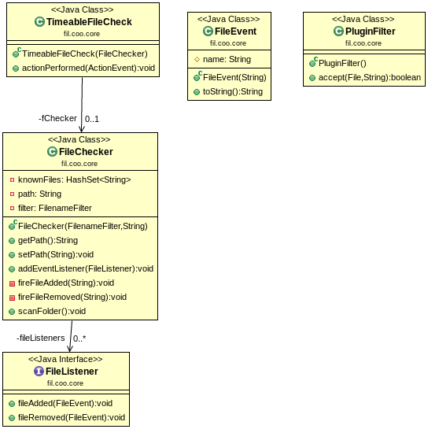
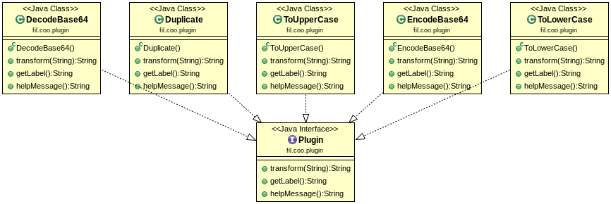
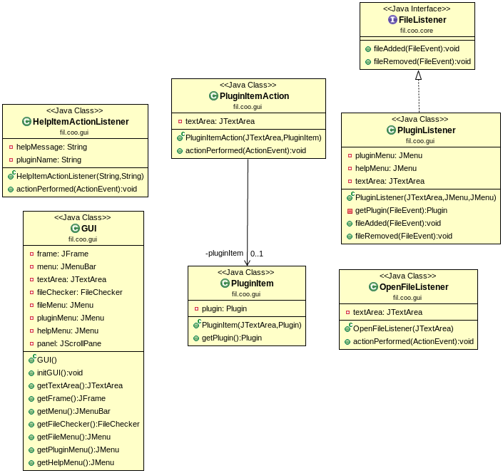

Projet n°4: Plugins
=====================

#### AUTEURS: DEROISSART Maxime @deroissart | SASU Daniel @sasu

> **Note:** Toute manipulation(commande) décrite dans ce fichier est effectuée depuis le dossier
> racine du projet.

Introduction
=============
L’objectif de ce projet est la mise en place
progressive d’une application qui s’adapte dynamiquement en fonction de
“plugins” installés dans un répertoire.
Dans ce projet on a utilisé des design patterns comme 'observer/observable' et
'decorator pattern' (void la classe `TimeableFileCheck`).

Contenu
=======

* [Arborescence Du Projet](#arborescence-du-projet)
* [UML](#uml)
* [Comment récupérer le projet](#comment-récupérer-le-projet)
* [Compilation et exécution des tests](#compilation-et-exécution-des-tests)
* [Creation d'un exécutable .jar](#creation-dun-exécutable-jar)
* [Comment générer la documentation](#comment-générer-la-documentation)
* [Comment "nettoyer" le projet](#comment-nettoyer-le-projet)
* [Compilation et exécution des programmes  qui correspondent aux exercices 1-4](#compilation-et-exécution-des-programmes-qui-correspondent-aux-exercices-1-4)


Arborescence Du Projet
----------------------
```
$ tree
.
├── plugins_test
├── pom.xml
├── README.md
├── resources
└── src
    ├── main
    │   └── java
    │       └── fil
    │           └── coo
    │               ├── core
    │               │   ├── FileChecker.java
    │               │   ├── FileEvent.java
    │               │   ├── FileListener.java
    │               │   ├── PluginFilter.java
    │               │   └── TimeableFileCheck.java
    │               ├── exercices
    │               │   ├── BeginsWithC.java
    │               │   ├── ClassFiles.java
    │               │   ├── ClassObserver.java
    │               │   ├── Exo1.java
    │               │   ├── Exo2.java
    │               │   ├── Exo3.java
    │               │   ├── Exo4.java
    │               │   ├── FileChecker.java
    │               │   ├── FileEvent.java
    │               │   ├── FileListener.java
    │               │   ├── PluginFilter.java
    │               │   └── PluginObserver.java
    │               ├── gui
    │               │   ├── GUI.java
    │               │   ├── HelpItemActionListener.java
    │               │   ├── OpenFileListener.java
    │               │   ├── PluginItemAction.java
    │               │   ├── PluginItem.java
    │               │   └── PluginListener.java
    │               ├── Main.java
    │               └── plugin
    │                   ├── DecodeBase64.java
    │                   ├── Duplicate.java
    │                   ├── EncodeBase64.java
    │                   ├── Plugin.java
    │                   ├── ToLowerCase.java
    │                   └── ToUpperCase.java
    └── test
        └── java
            └── fil
                └── coo
                    └── core
                        ├── FileCheckerTest.java
                        └── PluginFilterTest.java

16 directories, 34 files

```
UML
====

> **Note:** Les programmes des exercices 1-4 se retrouvent dans le paquetage
`fil.coo.exercices`.

package `fil.coo.core`
---------------


package `fil.coo.plugin`
---------------


package `fil.coo.gui`
---------------



Comment récupérer le projet
-----------------------------

1. Lancer le terminal de commandes
2. Entrer la commande suivante:

```
$ git clone git@gitlab-etu.fil.univ-lille1.fr:deroissart/COO.git
```

```
$ git pull git@gitlab-etu.fil.univ-lille1.fr:deroissart/COO.git
```

Compilation et exécution des tests
----------------------------------
```
$ mvn test
```

Creation d'un exécutable .jar
------------------------------

```
$ mvn package #création du package .jar
$ java -jar target/coo-project_plugins-1.0-SNAPSHOT.jar # exécution

```
> **Note:** Pour utiliser les plugins il faut copier les fichier `.class`
qui se retrouvent dans target/classes/fil/coo/plugin/ dans le dossier resources.


Comment générer la documentation
----------------------------------

```
$ mvn javadoc:javadoc
```

> **Note:** On retrouve le fichier index.html dans le dossier coo-project_plugins/target/docs.


Comment "nettoyer" le projet
------------------------------

```
$ mvn clean
```


Cela supprimera le dossier target, l'archive exécutable, la documentation générée et enfin les fichiers compilés.


Compilation et exécution des programmes  qui correspondent aux exercices 1-4
-----------------------------------------------------------------------------
Les programmes 2-4 prennent en argument sur la ligne de commande un chemin.

**Syntaxe:**
```
java fil.coo.exercices.[PROGRAMME] [CHEMIN]
```
**Exemple:**
```
$mvn compile
...
$ cd target/classes

target/classes$ java fil.coo.exercices.Exo2 fil/coo/exercices/

 ---- Files that begin with C: ----
ClassFiles.class
ClassObserver.class

 ---- Files that begin with .class: ----
ClassFiles.class
PluginFilter.class
Exo1$ShowTime.class
FileChecker.class
Exo4.class
ClassObserver.class
Exo3$Wrapper.class
Exo2.class
BeginsWithC.class
FileListener.class
FileEvent.class
PluginObserver.class
Exo4$Wrapper.class
Exo3.class
Exo1.class


target/classes$ java fil.coo.exercices.Exo3 fil/coo/exercices/
ClassFiles.class detecté
PluginFilter.class detecté
Exo1$ShowTime.class detecté
FileChecker.class detecté
Exo4.class detecté
ClassObserver.class detecté
Exo3$Wrapper.class detecté
Exo2.class detecté
BeginsWithC.class detecté
FileListener.class detecté
FileEvent.class detecté
PluginObserver.class detecté
Exo4$Wrapper.class detecté
Exo3.class detecté
Exo1.class detecté
^C
...
target/classes$ java fil.coo.exercices.Exo4 fil/coo/plugin/
DecodeBase64.class plugin found!
Duplicate.class plugin found!
EncodeBase64.class plugin found!
ToUpperCase.class plugin found!
ToLowerCase.class plugin found!
^C
..
```
