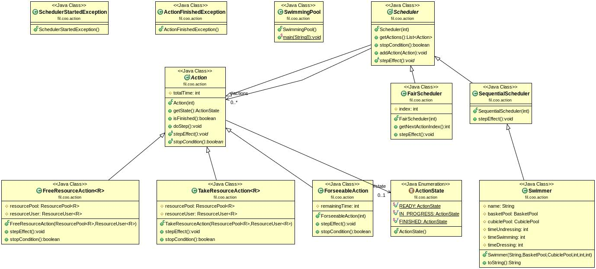
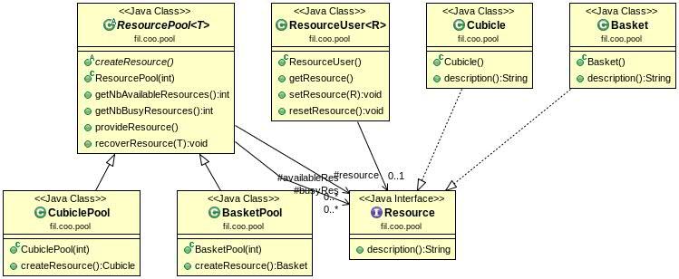

Projet n°2: Piscine
=====================

#### AUTEURS: DEROISSART Maxime @deroissart | SASU Daniel @sasu

> **Note:** Toute manipulation(commande) décrite dans ce fichier est effectuée depuis le dossier
> racine du projet.

Contenu
=======

* [Arborescence Du Projet](#arborescence-du-projet)
* [UML](#uml)
* [Comment récupérer le projet](#comment-récupérer-le-projet)
* [Compilation et exécution des tests](#compilation-et-exécution-des-tests)
* [Creation d'un exécutable .jar](#creation-dun-exécutable-jar)
* [Comment générer la documentation](#comment-générer-la-documentation)
* [Comment "nettoyer" le projet](#comment-nettoyer-le-projet)


Arborescence Du Projet
----------------------
```
.
├── pom.xml
├── README.md
└── src
    ├── main
    │   └── java
    │       ├── fil
    │       │   └── coo
    │       │       ├── action
    │       │       │   ├── ActionFinishedException.java
    │       │       │   ├── Action.java
    │       │       │   ├── ActionState.java
    │       │       │   ├── FairScheduler.java
    │       │       │   ├── ForseeableAction.java
    │       │       │   ├── FreeResourceAction.java
    │       │       │   ├── Scheduler.java
    │       │       │   ├── SchedulerStartedException.java
    │       │       │   ├── SequentialScheduler.java
    │       │       │   ├── Swimmer.java
    │       │       │   └── TakeResourceAction.java
    │       │       └── pool
    │       │           ├── Basket.java
    │       │           ├── BasketPool.java
    │       │           ├── Cubicle.java
    │       │           ├── CubiclePool.java
    │       │           ├── Resource.java
    │       │           ├── ResourcePool.java
    │       │           └── ResourceUser.java
    │       └── SwimmingPool.java
    └── test
        └── java
            └── fil
                └── coo
                    ├── action
                    │   ├── ActionTest.java
                    │   ├── FairSchedulerTest.java
                    │   ├── ForseeableActionTest.java
                    │   ├── FreeResourceActionTest.java
                    │   ├── SequentialSchedulerTest.java
                    │   └── TakeResourceActionTest.java
                    └── pool
                        ├── BasketPoolTest.java
                        ├── BasketUserTest.java
                        ├── CubiclePoolTest.java
                        ├── CubicleUserTest.java
                        ├── ResourcePoolTest.java
                        └── ResourceUserTest.java

```

UML
====

package action
---------------


package pool
---------------


Comment récupérer le projet
-----------------------------

1. Lancer le terminal de commandes
2. Entrer la commande suivante:

```
$ git clone git@gitlab-etu.fil.univ-lille1.fr:deroissart/COO.git
```

Compilation et exécution des tests
----------------------------------
```
$ mvn test
```

Creation d'un exécutable .jar
------------------------------

```
$ mvn package #création du package .jar
$ java -jar target/coo-project_pool-1.0-SNAPSHOT.jar # exécution
```

Comment générer la documentation
----------------------------------

```
$ mvn javadoc:javadoc
```

> **Note:** On retrouve le fichier index.html dans le dossier coo-project_pool/target/docs.


Comment "nettoyer" le projet
------------------------------

```
$ mvn clean
```


Cela supprimera le dossier target, l'archive exécutable, la documentation générée et enfin les fichiers compilés.
