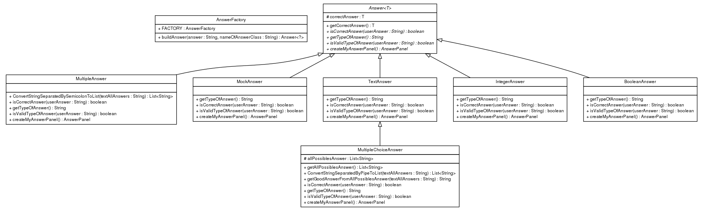
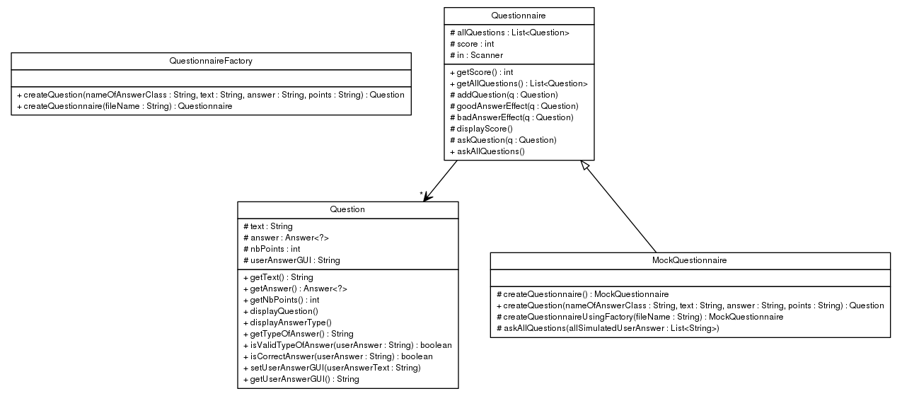
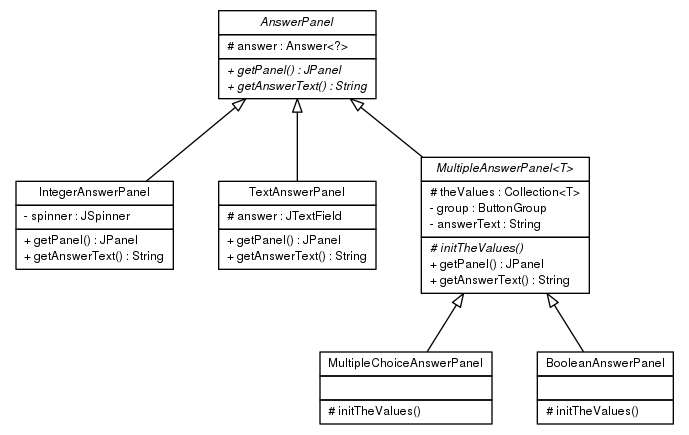
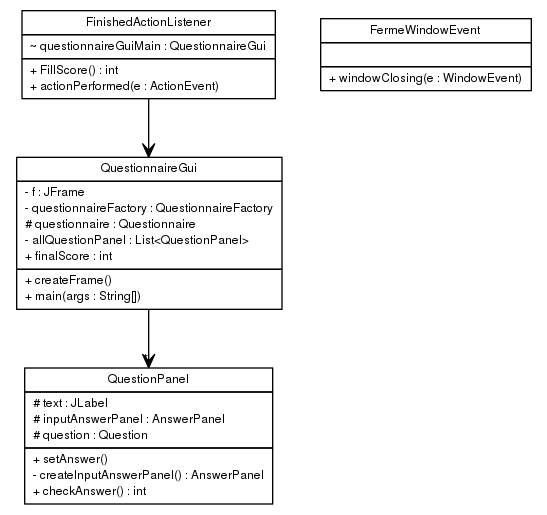

Projet n°3: Quizz
=====================

#### AUTEURS: DEROISSART Maxime @deroissart | SASU Daniel @sasu

> **Note:** Toute manipulation(commande) décrite dans ce fichier est effectuée depuis le dossier
> racine du projet.

Contenu
=======

* [Arborescence Du Projet](#arborescence-du-projet)
* [Comment récupérer le projet](#comment-récupérer-le-projet)
* [Compilation et exécution des tests](#compilation-et-exécution-des-tests)
* [Creation d'un exécutable .jar](#creation-dun-exécutable-jar)
* [Comment générer la documentation](#comment-générer-la-documentation)
* [Comment "nettoyer" le projet](#comment-nettoyer-le-projet)


Arborescence Du Projet
----------------------
```
.
├── fil.coo.answer.graphical.png
├── fil.coo.answer.png
├── fil.coo.question.graphical.png
├── fil.coo.question.png
├── pom.xml
├── question_tolkien_2.txt
├── question_tolkien.txt
├── README.md
└── src
    ├── main
    │   └── java
    │       └── fil
    │           └── coo
    │               ├── answer
    │               │   ├── AnswerFactory.java
    │               │   ├── Answer.java
    │               │   ├── BooleanAnswer.java
    │               │   ├── graphical
    │               │   │   ├── AnswerPanel.java
    │               │   │   ├── BooleanAnswerPanel.java
    │               │   │   ├── IntegerAnswerPanel.java
    │               │   │   ├── MultipleAnswerPanel.java
    │               │   │   ├── MultipleChoiceAnswerPanel.java
    │               │   │   └── TextAnswerPanel.java
    │               │   ├── IntegerAnswer.java
    │               │   ├── MockAnswer.java
    │               │   ├── MultipleAnswer.java
    │               │   ├── MultipleChoiceAnswer.java
    │               │   └── TextAnswer.java
    │               ├── MainQuestionnaire.java
    │               └── question
    │                   ├── graphical
    │                   │   ├── QuestionnaireGui.java
    │                   │   └── QuestionPanel.java
    │                   ├── MockQuestionnaire.java
    │                   ├── Question.java
    │                   ├── QuestionnaireFactory.java
    │                   └── Questionnaire.java
    └── test
        └── java
            └── fil
                └── coo
                    ├── answer
                    │   └── AnswerTest.java
                    └── question
                        ├── QuestionnaireTest.java
                        └── QuestionTest.java

15 directories, 32 files


```
UML
====

package `answer`
---------------


package `question`
---------------


package `answer.graphical`
---------------


package `question.graphical`
---------------


Comment récupérer le projet
-----------------------------

1. Lancer le terminal de commandes
2. Entrer la commande suivante:

```
$ git clone git@gitlab-etu.fil.univ-lille1.fr:deroissart/COO.git
```

Compilation et exécution des tests
----------------------------------
```
$ mvn test
```

Creation d'un exécutable .jar
------------------------------

```
$ mvn package #création du package .jar
$ java -jar target/coo-project_pool-1.0-SNAPSHOT.jar # exécution
- t pour lancer le mode textuel
- g pour lancer le mode graphique
```

Comment générer la documentation
----------------------------------

```
$ mvn javadoc:javadoc
```

> **Note:** On retrouve le fichier index.html dans le dossier coo-project_quiz/target/docs.

> **Note:** On retrouve également les différents Diagrammes UML dans coo-project_quiz/target/docs/fil/coo


Comment "nettoyer" le projet
------------------------------

```
$ mvn clean
```


Cela supprimera le dossier target, l'archive exécutable, la documentation générée et enfin les fichiers compilés.
